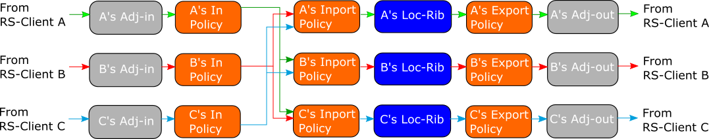

# Policy configuration

This page explains GoBGP policy feature. Note that the feature is
still under development. Currently the feature is usable with route
server use case

## Prerequisites

Assumed that you finished [Getting Started](https://github.com/osrg/gobgp/blob/master/docs/sources/getting-started.md) and [Route Server](https://github.com/osrg/gobgp/blob/master/docs/sources/route-server.md).

## Configuration

A policy consists of a match and an action. A match defines if an
action will be applied to a route. For now, GoBGP uses only the source
of a peer and a prefix as match conditions. Only dropping and
accepting are supported as an action.

GoBGP supports **import** and **export** policies with respect to the
local routing table. The **import** policy defines what routes will be
imported into its local RIBs. The **export** policy defines what
routes will be exported from its local RIBs.



This example the configuration in [Route
Server](https://github.com/osrg/gobgp/blob/master/docs/sources/route-server.md)
with one more peer (IP:10.0.255.3, AS:65001).

Neighbor 10.0.255.1 advertises 10.33.0.0/16 and 10.3.0.0/16 routes. We
define an import policy for neighbor 10.0.255.2 that drops
10.33.0.0/16 route from Neighbor 10.0.255.1.

```
[Global]
  [Global.GlobalConfig]
    As = 64512
    RouterId = "192.168.255.1"

[Neighbors]
  [[Neighbors.NeighborList]]
    [Neighbors.NeighborList.NeighborConfig]
      NeighborAddress = "10.0.255.1"
      PeerAs = 65001
    [Neighbors.NeighborList.RouteServer]
      [Neighbors.NeighborList.RouteServer.RouteServerConfig]
        RouteServerClient = true

  [[Neighbors.NeighborList]]
    [Neighbors.NeighborList.NeighborConfig]
      NeighborAddress = "10.0.255.2"
      PeerAs = 65002
    [Neighbors.NeighborList.RouteServer]
      [Neighbors.NeighborList.RouteServer.RouteServerConfig]
        RouteServerClient = true
    [Neighbors.NeighborList.ApplyPolicy]
      [Neighbors.NeighborList.ApplyPolicy.ApplyPolicyConfig]
        ImportPolicy = ["pd2"]

  [[Neighbors.NeighborList]]
    [Neighbors.NeighborList.NeighborConfig]
      NeighborAddress = "10.0.255.3"
      PeerAs = 65003
    [Neighbors.NeighborList.RouteServer]
      [Neighbors.NeighborList.RouteServer.RouteServerConfig]
        RouteServerClient = true

[DefinedSets]
  [DefinedSets.PrefixSets]
    [[DefinedSets.PrefixSets.PrefixSetList]]
      PrefixSetName = "ps2"
      [[DefinedSets.PrefixSets.PrefixSetList.PrefixList]]
        IpPrefix = "10.33.0.0/16"
      [[DefinedSets.PrefixSets.PrefixSetList.PrefixList]]
        IpPrefix = "10.50.0.0/16"


  [DefinedSets.NeighborSets]
    [[DefinedSets.NeighborSetList]]
      NeighborSetName = "ns1"
      [[DefinedSets.NeighborSetList.NeighborInfoList]]
        Address = "10.0.255.1"

[PolicyDefinitions]
  [[PolicyDefinitions.PolicyDefinitionList]]
    Name = "pd2"
    [PolicyDefinitions.PolicyDefinitionList.Statements]
      [[PolicyDefinitions.PolicyDefinitionList.Statements.StatementList]]
        Name = "statement1"
        [PolicyDefinitions.PolicyDefinitionList.Statements.StatementList.Conditions]
          [PolicyDefinitions.PolicyDefinitionList.Statements.StatementList.Conditions.MatchPrefixSet]
            PrefixSet = "ps2"
            MatchSetOptions = 0
          [PolicyDefinitions.PolicyDefinitionList.Statements.StatementList.Conditions.MatchNeighborSet]
            NeighborSet = "ns1"
            MatchSetOptions = 0
        [PolicyDefinitions.PolicyDefinitionList.Statements.StatementList.Actions]
          [PolicyDefinitions.PolicyDefinitionList.Statements.StatementList.Actions.RouteDisposition]
            RejectRoute = true
```

Neighbor 10.0.255.2 has pd2 policy. The pd2 policy consists of ps2 prefix match and ns1 neighbor match. The ps2 specifies 10.33.0.0 and 10.50.0.0 address. The ps2 specifies the mask with **MASK** keyword. **MasklengthRange** keyword can specify the range of mask length like ```MasklengthRange 24..26```. The *ns1* specifies neighbor 10.0.255.1.

The pd2 sets multiple condition, This means that only when all match conditions meets, the policy will be applied.

The MatchPrefixSet sets MatchSetOptions to 0. This means that when match to any of PrefixList, the policy will be applied. the policy will be applied to 10.33.0.0/16 or 10.50.0.0 route from neighbor 10.0.255.1.

If the MatchPrefixSet sets MatchSetOptions to 1, It does not match to any of PrefixList, the policy will be applied. the policy will be applied to other than 10.33.0.0/16 or 10.50.0.0 route from neighbor 10.0.255.1

## Checking

Confirm that 10.0.255.1 neighbor advertises two routes.

```
$ gobgp neighbor 10.0.255.1 adj-in
   Network            Next Hop        AS_PATH    Age        Attrs
   10.3.0.0/16        10.0.255.1      [65001]    00:51:57   [{Origin: 0} {Med: 0}]
   10.33.0.0/16       10.0.255.1      [65001]    00:51:57   [{Origin: 0} {Med: 0}]
```

Now let's check out if the policy works as expected.

```
$ gobgp neighbor 10.0.255.2 local
   Network            Next Hop        AS_PATH    Age        Attrs
*> 10.3.0.0/16        10.0.255.1      [65001]    00:49:36   [{Origin: 0} {Med: 0}]
$ gobgp neighbor 10.0.255.3 local
   Network            Next Hop        AS_PATH    Age        Attrs
*> 10.3.0.0/16        10.0.255.1      [65001]    00:49:38   [{Origin: 0} {Med: 0}]
*> 10.33.0.0/16       10.0.255.1      [65001]    00:49:38   [{Origin: 0} {Med: 0}]
```
