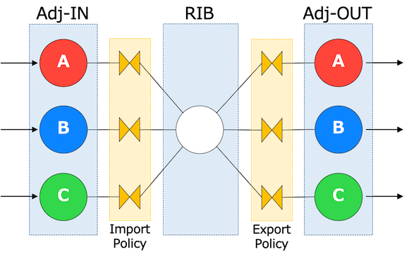

# Policy configuration

This page explains GoBGP policy feature for controlling the route
advertisement. It might be called Route Map in other BGP
implementations.

We explain the overview firstly, then the details, 

## Prerequisites

Assumed that you finished [Getting Started](https://github.com/osrg/gobgp/blob/master/docs/sources/getting-started.md).

## Contents
- [Overview](#overview)
- [Policy Model](#model)
- [Route Server Policy Model](#rs-model)
- [Policy Structure](#policy)
- [Policy Configuration](#configuration)


## <a name="overview"> Overview

Policy is a way to control how BGP routes inserted to RIB or advertised to
peers. Policy has two parts, **Condition** and **Action**. 
When a policy is configured, **Action** is applied to routes which meet **Condition**
before routes proceed to next step.

GoBGP supports **Condition** like `prefix`, `neighbor`(source/destination of the route),
`aspath` etc.., and **Action** like `accept`, `reject`, `MED/aspath/community manipulation`
etc...

You can configure policy by configuration file, CLI or gRPC API.

## <a name="model"> Policy Model

The following figure shows how policy works in normal BGP configuration.

<p align="center">
    
</p>

There are **Import** and **Export** policy. **Import** policy is invoked
before best path calculation and pushing routes to RIB.
**Export** policy is invoked after that.

You can check each policy by the following commands.

```shell
$ gobgp global policy import
$ gobgp global policy export
```

## <a name="rs-model"> Route Server Policy Model

The following figure shows how policy works in [route server BGP configuration](https://github.com/osrg/gobgp/blob/master/docs/sources/route-server.md).

<p align="center">
    
</p>

In route server mode, adding to **Import** and **Export**, we have **In** policy.

**Import** and **Export** policies are defined with respect to the
local routing table. The **Import** policy defines what routes will be
imported into its local RIBs. The **Export** policy defines what
routes will be exported from its local RIBs. **In** polices are
defined with respect to a peer. The **In** policy defines what routes will go
to other peers' local routing tables.

You can check each policy by the following commands.

```shell
$ gobgp neighbor <neighbor-addr> policy in
$ gobgp neighbor <neighbor-addr> policy import
$ gobgp neighbor <neighbor-addr> policy export
```

## <a name="policy"> Policy Stracture

<p align="center">
    
</p>

A policy consists of statements. Each statement has condition(s) and action(s).

Conditions are categorized into attributes below:

- prefix
- neighbor
- aspath
- aspath length
- community
- extended community
- rpki validation result

Actions are categorized into attributes below:

- accept or reject
- add/replace/remove community or remove all communities
- add/subtract or replace MED value
- set next-hop
- prepend AS number in the AS_PATH attribute

If All condition in the statement are true, the action(s) in the statement are executed.

A condition can have multiple values. For example, you can define a prefix
condition that has 10.20.0.0/16, 10.30.3.0/24, and 10.30.4.0/24. You can specify
how these values are used to decide whether the condition is true or
false. In this case, you can specify either:

- true if a route matches any of 10.20.0.0/16, 10.30.3.0/24, and 10.30.4.0/24.
- true if a route matches none of 10.20.0.0/16, 10.30.3.0/24, and 10.30.4.0/24.

You can check policy configuration by the following commands.

```shell
$ gobgp policy
$ gobgp policy statement
$ gobgp policy prefix
$ gobgp policy neighbor
$ gobgp policy as-path
$ gobgp policy community
$ gobgp policy ext-community
```

## <a name="configuration"> Policy Configuration

GoBGP's configuration file has two parts named **DefinedSets** and **PolicyDefinitions** as its policy configuration. **DefinedSets** part defines conditions. **PolicyDefinitions** defines policies based on actions and these conditions.


 - DefinedSets

 A single DefinedSets entry has prefix match that is named PrefixSets and neighbor match part that is named NeighborSets. It also has BgpDefinedSets, a subset of DefinedSets that defines conditions referring to BGP attributes such as aspath. This DefinedSets has a name and it's used to refer to DefinedSets items from outside.

 - PolicyDefinitions

 PolicyDefinitions has PolicyDefinitionList, it's a list of policy.
 A single element of PolicyDefinitionList has a statement part that combines conditions with an action.


These are steps to define policy:

1. define DefinedSets
  1. define PrefixSets
  1. define NeighborSets
1.  define BgpDefinedSets
  1. define CommunitySets
  1. define ExtCommunitySets
  1. define AsPathSetList
1. define PolicyDefinitions
1. attach policies to a neighbor


### 1. Defining DefinedSets
DefinedSets has prefix information and neighbor information in PrefixSets and NeighborSets section, and GoBGP uses these information to evaluate routes.
Defining DefinedSets is needed at first.
PrefixSets and NeighborSets section are prefix match part and neighbor match part.

- DefinedSets example

 ```toml
# prefix match part
[[defined-sets.prefix-sets]]
  prefix-set-name = "ps1"
  [[defined-sets.prefix-sets.prefix-list]]
    ip-prefix = "10.33.0.0/16"
    masklength-range = "21..24"

# neighbor match part
[[defined-sets.neighbor-sets]]
  neighbor-set-name = "ns1"
  neighbor-info-list = ["10.0.255.1"]
 ```

  ----

 #### PrefixSets
 PrefixSets has PrefixSetList, and PrefixSetList has PrefixSetName and PrefixList as its element. PrefixSetList is used as a condition.

 **PrefixSetList** has 1 element and list of subelement.

 | Element         | Description                        | Example       | Optional   |
 |-----------------|------------------------------------|---------------|------------|
 | PrefixSetName   | name of PrefixSet                  | "ps1"         |            |
 | PrefixList      | list of prefix and range of length |               |            |

 **PrefixLlist** has 2 elements.

 | Element         | Description       | Example       | Optional   |
 |-----------------|-------------------|---------------|------------|
 | IpPrefix        | prefix value      | "10.33.0.0/16"|            |
 | MasklengthRange | range of length   | "21..24"      | Yes        |


 ##### Examples
 - example 1
    - Match routes whose high order 2 octets of NLRI is 10.33 and its prefix length is between from 21 to 24
    - If you define a PrefixList that doesn't have MasklengthRange, it matches routes that have just 10.33.0.0/16 as NLRI.

  ```toml
  # example 1
  [[defined-sets.prefix-sets]]
    prefix-set-name = "ps1"
    [[defined-sets.prefix-sets.prefix-list]]
      ip-prefix = "10.33.0.0/16"
      masklength-range = "21..24"
  ```


 - example 2
    - If you want to evaluate multiple routes with a single PrefixSetList, you can do this by adding an another PrefixList like this:
    - This PrefixSetList match checks if a route has 10.33.0.0/21 to 24 or 10.50.0.0/21 to 24.

  ```toml
  # example 2
  [[defined-sets.prefix-sets]]
    prefix-set-name = "ps1"
    [[defined-sets.prefix-sets.prefix-list]]
      ip-prefix = "10.33.0.0/16"
      masklength-range = "21..24"
    [[defined-sets.prefix-sets.prefix-list]]
      ip-prefix = "10.50.0.0/16"
      masklength-range = "21..24"
  ```

 - example 3
    - PrefixSetName under PrefixSetList is reference to a single PrefixSet.
    - If you want to add different PrefixSet more, you can add other blocks that form the same structure with example 1.

  ```toml
  # example 3
  [[defined-sets.prefix-sets]]
    prefix-set-name = "ps1"
    [[defined-sets.prefix-sets.prefix-list]]
      ip-prefix = "10.33.0.0/16"
      masklength-range = "21..24"
  [[defined-sets.prefix-sets]]
    prefix-set-name = "ps2"
    [[defined-sets.prefix-sets.prefix-list]]
      ip-prefix = "10.50.0.0/16"
      masklength-range = "21..24"
  ```

  ----

 #### NeighborSets

 NeighborSets has NeighborSetList, and NeighborSetList has NeighborSetName and NeighborInfoList as its element. It is necessary to specify a neighbor address in NeighborInfoList. NeighborSetList is used as a condition.

 **NeighborSetList** has 1 element and list of subelement.

 | Element          |Description                | Example      | Optional   |
 |------------------|---------------------------|--------------|------------|
 | NeighborSetName  | name of NeighborSet       | "ns1"        |            |
 | NeighborInfoList | list of neighbor address  |              |            |

 **NeighborInfoList** has 1 element.

 | Element         |Description          | Example      | Optional   |
 |-----------------|---------------------|--------------|------------|
 | Address         | neighbor address    | "10.0.255.1" |            |

 ##### Examples

 - example 1
  ```toml
  # example 1
  [[defined-sets.neighbor-sets]]
    neighbor-set-name = "ns1"
    neighbor-info-list = ["10.0.255.1"]
  ```

 - example 2
    - As with PrefixSetList, NeighborSetList can have multiple NeighborInfoList like this.

  ```toml
  # example 2
  [[defined-sets.neighbor-sets]]
    neighbor-set-name = "ns1"
    neighbor-info-list = ["10.0.255.1", "10.0.255.2"]
  ```

 - example 3
    - As with PrefixSetList, multiple NeighborSetLists can be defined. 
 
  ```toml
  # example 3
  [[defined-sets.neighbor-sets]]
    neighbor-set-name = "ns1"
    neighbor-info-list = ["10.0.255.1"]
  # another NeighborSetList
  [[defined-sets.neighbor-sets]]
    neighbor-set-name = "ns2"
    neighbor-info-list = ["10.0.254.1"]
  ```

---

### 2. Defining BgpDefinedSets

BgpDefinedSets has Community information, Extended Community
information and AS_PATH information in each Sets section
respectively. And it is a child element of DefinedSets.
CommunitySets, ExtCommunitySets and AsPathSets section are each match
part. Like PrefixSets and NeighborSets, each can have multiple sets and each set can have multiple values.

- BgpDefinedSets example

 ```toml
 # Community match part
 [[defined-sets.bgp-defined-sets.community-sets]]
   community-set-name = "community1"
   community-list = ["65100:10"]
 # Extended Community match part
 [[defined-sets.bgp-defined-sets.ext-community-sets]]
   ext-community-set-name = "ecommunity1"
   ext-community-list = ["RT:65100:10"]
 # AS_PATH match part
 [[defined-sets.bgp-defined-sets.as-path-sets]]
   as-path-set-name = "aspath1"
   as-path-list = ["^65100"]
 ```

  ----

 #### CommunitySets
 CommunitySets has CommunitySetList, and CommunitySetList has CommunitySetName and CommunityList as its element. The Community value are used to evaluate communities held by the destination.

 **CommunitySetList** has 1 element and list of subelement.

 | Element          | Description             | Example      | Optional |
 |------------------|-------------------------|--------------|----------|
 | CommunitySetName | name of CommunitySet    | "community1" |          |
 | CommunityList    | list of community value |              |          |

 **CommunityList** has 1 element.

 | Element          | Description             | Example      | Optional |
 |------------------|-------------------------|--------------|----------|
 | Community        | community value         | "65100:10"   |          |

 You can use regular expressions to specify community in CommunityList.

 ##### Examples
 - example 1
   - Match routes which has "65100:10" as a community value.

  ```toml
  # example 1
  [[defined-sets.bgp-defined-sets.community-sets]]
    community-set-name = "community1"
    community-list = ["65100:10"]
  ```

 - example 2
    - Specifying community by regular expression
    - You can use regular expressions based on POSIX 1003.2 regular expressions.

  ```toml
  # example 2
  [[defined-sets.bgp-defined-sets.community-sets]]
    community-set-name = "community2"
    community-list = ["6[0-9]+:[0-9]+"]
  ```
   ----

 #### ExtCommunitySets
 ExtCommunitySets has ExtCommunitySetList, and ExtCommunitySetList has ExtCommunitySetName and ExtCommunityList as its element. The values are used to evaluate extended communities held by the destination.

 **ExtCommunitySetList** has 1 element and list of subelement.

 | Element             | Description                        | Example          | Optional |
 |---------------------|------------------------------------|------------------|----------|
 | ExtCommunitySetName | name of ExtCommunitySet            | "ecommunity1"    |          |
 | ExtCommunityList    | list of extended community value   |　　　             |          |

 **ExtCommunityList** has 1 element.

 | Element             | Description                | Example          | Optional |
 |---------------------|----------------------------|------------------|----------|
 | ExtCommunity        | extended community value   | "RT:65001:200"   |          |

 You can use regular expressions to specify extended community in ExtCommunityList.
 However, the first one element separated by (part of "RT") does not support to the regular expression.
 The part of "RT" indicates a subtype of extended community and subtypes that can be used are as follows:

  - RT: mean the route target.
  - SoO: mean the site of origin(route origin).

 ##### Examples
 - example 1
      - Match routes which has "RT:65001:200" as a extended community value.

  ```toml
  # example 1
  [[defined-sets.bgp-defined-sets.ext-community-sets]]
    ext-community-set-name = "ecommunity1"
    ext-community-list = ["RT:65100:200"]
  ```

 - example 2
    - Specifying extended community by regular expression
    - You can use regular expressions that is available in Golang.

  ```toml
  # example 2
  [[defined-sets.bgp-defined-sets.ext-community-sets]]
    ext-community-set-name = "ecommunity2"
    ext-community-list = ["RT:6[0-9]+:[0-9]+"]
  ```

   ----

 #### AsPathSets
 AsPathSets has AsPathSetList, and AsPathSetList has AsPathSetName and AsPathList as its element. The numbers are used to evaluate AS numbers in the destination's AS_PATH attribute.

 **AsPathSetList** has 1 element and list of subelement.

 | Element          | Description               | Example    | Optional |
 |------------------|---------------------------|------------|----------|
 | AsPathSetName    | name of AsPathSet         | "aspath1"  |          |
 | AsPathSet        | list of as path value     |            |          |

 **AsPathList** has 1 elements.

 | Element          | Description       | Example    | Optional |
 |------------------|-------------------|------------|----------|
 | AsPathSet        | as path value     | "^65100"   |          |

 The AS path regular expression is compatible with [Quagga](http://www.nongnu.org/quagga/docs/docs-multi/AS-Path-Regular-Expression.html) and Cisco.
 Note Character `_` has special meaning. It is abbreviation for `(^|[,{}() ]|$)`.

 Some examples follow:
    - From: `^65100_` means the route is passed from AS 65100 directly.
    - Any: `_65100_` means the route comes through AS 65100.
    - Origin: `_65100$` means the route is originated by AS 65100.
    - Only: `^65100$` means the route is originated by AS 65100 and comes from it directly.
    - `^65100_65001`
    - `65100_[0-9]+_.*$`
    - `^6[0-9]_5.*_65.?00$`

  ##### Examples
  - example 1
      - Match routes which come from AS 65100.

  ```toml
  # example 1
  [[defined-sets.bgp-defined-sets.as-path-sets]]
    as-path-set-name = "aspath1"
    as-path-list = ["^65100_"]
  ```

  - example 2
      - Match routes which come Origin AS 65100 and use regular expressions to other AS.

  ```toml
  # example 2
  [[defined-sets.bgp-defined-sets.as-path-sets]]
    as-path-set-name = "aspath1"
    as-path-list = ["[0-9]+_65[0-9]+_65100$"]
  ```

---

### 3. Defining PolicyDefinitions
PolicyDefinitions has PolicyDefinitionList, and PolicyDefinitionList consists of condition and action of the policy. The condition part evaluates routes from neighbors and applies action if the routes match conditions. You can use DefinedSets above and other conditions to specify conditions in the PolicyDefinitions.

PolicyDefinitions has PolicyDefinition as its element and the PolicyDefinition is a policy itself.
You can write condition and action under Statements.

 - an example of PolicyDefinitions

 ```toml
  [[policy-definitions]]
    name = "example-policy"
    [[policy-definitions.statements]]
      name = "statement1"
      [policy-definitions.statements.conditions.match-prefix-set]
        prefix-set = "ps1"
        match-set-options = "any"
      [policy-definitions.statements.conditions.match-neighbor-set]
        neighbor-set = "ns1"
        match-set-options = "invert"
      [policy-definitions.statements.conditions.bgp-conditions.match-community-set]
        community-set = "community1"
        match-set-options = "any"
      [policy-definitions.statements.conditions.bgp-conditions.match-ext-community-set]
        community-set = "ecommunity1"
        match-set-options = "any"
      [policy-definitions.statements.conditions.bgp-conditions.match-as-path-set]
        as-path-set = "aspath1"
        match-set-options = "any"
      [policy-definitions.statements.conditions.bgp-conditions.as-path-length]
        operator = "eq"
        value = 2
      [policy-definitions.statements.actions.route-dispodition]
        accept-route = true
      [policy-definitions.statements.actions.bgp-actions]
        set-med = "-200"
        [policy-definitions.statements.actions.bgp-actions.set-as-path-prepend]
          as = "65005"
          repeat-n = 5
        [policy-definitions.statements.actions.bgp-actions.set-community]
          options = "add"
          [policy-definitions.statements.actions.bgp-actions.set-community.set-community-method]
            communities-list = ["65100:20"]
 ```

 The elements of PolicyDefinitionList are as follows:

  - PolicyDefinitions.PolicyDefinitionList

 | Element | Description   | Example          |
 |---------|---------------|------------------|
 | name    | policy's name | "example-policy" |

  - PolicyDefinitionsPolicyDefinitionList.StatementList

 | Element | Description       | Example        |
 |---------|-------------------|----------------|
 | name    | statements's name | "statement1"   |

  - PolicyDefinitions.PolicyDefinitionList.Statements.StatementList.Conditions.MatchPrefixSet

 | Element          | Description                                                               | Example |
 |------------------|---------------------------------------------------------------------------|---------|
 | PrefixSet        | name for DefinedSets.PrefixSets.PrefixSetList that is used in this policy | "ps1"   |
 | MatchSetOptions  | option for the check:<br> "any" or "invert". default is "any"             | "any"   |

  - PolicyDefinitions.PolicyDefinitionList.Statements.StatementList.Conditions.MatchNegihborSet

 | Element          | Description                                                                   | Example |
 |------------------|-------------------------------------------------------------------------------|---------|
 | NegihborSet      | name for DefinedSets.NeighborSets.NeighborSetList that is used in this policy | "ns1"   |
 | MatchSetOptions  | option for the check:<br> "any" or "invert". default is "any"                 | "any"   |

  - PolicyDefinitions.PolicyDefinitionList.Statements.StatementList.Conditions.BgpConditions.MatchCommunitySet

 | Element          | Description                                                                                    | Example        |
 |------------------|------------------------------------------------------------------------------------------------|----------------|
 | CommunitySet     | name for DefinedSets.BgpDefinedSets.CommunitySets.CommunitySetList that is used in this policy | "community1"   |
 | MatchSetOptions  | option for the check:<br> "any" or "all" or "invert". default is "any"                         | "invert"       |

  - PolicyDefinitions.PolicyDefinitionList.Statements.StatementList.Conditions.BgpConditions.MatchExtCommunitySet

 | Element          | Description                                                                                          | Example       |
 |------------------|------------------------------------------------------------------------------------------------------|---------------|
 | ExtCommunitySet  | name for DefinedSets.BgpDefinedSets.ExtCommunitySets.ExtCommunitySetList that is used in this policy | "ecommunity1" |
 | MatchSetOptions  | option for the check:<br> "any" or "all" or "invert". default is "any"                               | "invert"      |

  - PolicyDefinitions.PolicyDefinitionList.Statements.StatementList.Conditions.BgpConditions.MatchAsPathSet

 | Element          | Description                                                                                    | Example   |
 |------------------|------------------------------------------------------------------------------------------------|-----------|
 | AsPathSet        | name for DefinedSets.BgpDefinedSets.AsPathSets.AsPathSetList that is used in this policy       | "aspath1" |
 | MatchSetOptions  | option for the check:<br> "any" or "all" or "invert". default is "any"                         | "invert"  |

  - PolicyDefinitions.PolicyDefinitionList.Statements.StatementList.Conditions.BgpConditions.AsPathLength

 | Element  | Description                                                                                        | Example |
 |----------|----------------------------------------------------------------------------------------------------|---------|
 | Operator | operator to compare the length of AS number in AS_PATH attribute. <br> "eq","ge","le" can be used. <br> "eq" means that length of AS number is equal to Value element <br> "ge" means that length of AS number is equal or greater than the Value element <br> "le" means that length of AS number is equal or smaller than the Value element| "eq"    |
 | Value    | value used to compare with the length of AS number in AS_PATH attribute                            | 2       |

  - PolicyDefinitions.PolicyDefinitionList.Statements.StatementList.Actions.RouteDisposition

 | Element     | Description                                                                       | Example |
 |-------------|-----------------------------------------------------------------------------------|---------|
 | AcceptRoute | action to accept the route if matches conditions. If true, this route is accepted | true    |

  - PolicyDefinitions.PolicyDefinitionList.Statements.StatementList.Actions.BgpActions

 | Element | Description                                                                           | Example |
 |---------|---------------------------------------------------------------------------------------|---------|
 | SetMed  | SetMed used to change the med value of the route. <br> If only numbers have been specified, replace the med value of route.<br> if number and operater(+ or -) have been specified, adding or subtracting the med value of route. | "-200"    |

  - PolicyDefinitions.PolicyDefinitionList.Statements.StatementList.Actions.BgpActions.SetCommunity

 | Element     | Description                                                                      | Example    |
 |-------------|----------------------------------------------------------------------------------|------------|
 | Options     | operator to manipulate Community attribute in the route                          | "ADD"      |
 | Communities | communities used to manipulate the route's community accodriong to Options below | "65100:20" |

  - PolicyDefinitions.PolicyDefinitionList.Statements.StatementList.Actions.BgpActions.SetAsPathPrepend

 | Element | Description                                                                                           | Example |
 |---------|-------------------------------------------------------------------------------------------------------|---------|
 | As      | AS number to prepend. You can use "last-as" to prepend the leftmost AS number in the aspath attribute.| "65100" |
 | RepeatN | repeat count to prepend AS                                                                            |    5    |


 - Execution condition of Action

 Action statement is executed when the result of each Condition, including MatchSetOption is all true.
 **MatchSetOptions** is defined how to determine the match result, in the condition with multiple evaluation set as follows:

 | Value  | Description                                                               |
 |--------|---------------------------------------------------------------------------|
 | any    | match is true if given value matches any member of the defined set        |
 | all    | match is true if given value matches all members of the defined set       |
 | invert | match is true if given value does not match any member of the defined set |


 <br>

##### Examples
 - example 1
  - This PolicyDefinition has PrefixSet *ps1* and NeighborSet *ns1* as its condition and routes matches the condition is rejected.

 ```toml
 # example 1
 [[policy-definitions]]
   name = "policy1"
   [[policy-definitions.statements]]
     name = "statement1"
     [policy-definitions.statements.conditions.match-prefix-set]
       prefix-set = "ps1"
     [policy-definitions.statements.conditions.match-neighbor-set]
       neighbor-set = "ns1"
     [policy-definitions.statements.actions.route-dispodition]
       reject-route = true
 ```

 - example 2
  - PolicyDefinition has two statements

 ```toml
 # example 2
 [[policy-definitions]]
   name = "policy1"
   # first statement - (1)
   [[policy-definitions.statements]]
     name = "statement1"
     [policy-definitions.statements.conditions.match-prefix-set]
       prefix-set = "ps1"
     [policy-definitions.statements.conditions.match-neighbor-set]
       neighbor-set = "ns1"
     [policy-definitions.statements.actions.route-dispodition]
       reject-route = true
   # second statement - (2)
   [[policy-definitions.statements]]
     name = "statement2"
     [policy-definitions.statements.conditions.match-prefix-set]
       prefix-set = "ps2"
     [policy-definitions.statements.conditions.match-neighbor-set]
       neighbor-set = "ns2"
     [policy-definitions.statements.actions.route-dispodition]
       reject-route = true
 ```
  - if a route matches the condition inside the first statement(1), GoBGP applies its action and quits the policy evaluation.


 - example 3
  - If you want to add other policies, just add PolicyDefinitionList block following the first one like this

 ```toml
 # example 3
 # first policy
 [[policy-definitions]]
    name = "policy1"
    [[policy-definitions.statements]]
      name = "statement1"
      [policy-definitions.statements.conditions.match-prefix-set]
        prefix-set = "ps1"
      [policy-definitions.statements.conditions.match-neighbor-set]
        neighbor-set = "ns1"
      [policy-definitions.statements.actions.route-dispodition]
        reject-route = true
 # second policy
 [[policy-definitions]]
    name = "policy2"
    [[policy-definitions.statements]]
      name = "statement2"
      [policy-definitions.statements.conditions.match-prefix-set]
        prefix-set = "ps2"
      [policy-definitions.statements.conditions.match-neighbor-set]
        neighbor-set = "ns2"
      [policy-definitions.statements.actions.route-dispodition]
        reject-route = true
 ```

 - example 4
  - This PolicyDefinition has multiple conditions including BgpConditions as follows:
    - PrefixSet: *ps1*
    - NeighborSet: *ns1*
    - CommunitySet: *community1*
    - ExtCommunitySet: *ecommunity1*
    - AsPathSet: *aspath1*
    - AsPath length: *equal 2*

  - If a route matches all these conditions, the route is accepted and added community "65100:20" and subtracted 200 from med value and prepended 65005 five times in its AS_PATH attribute, and also next-hop 10.0.0.1 is set.

 ```toml
 # example 4
 [[policy-definitions]]
    name = "policy1"
    [[policy-definitions.statements]]
      name = "statement1"
      [policy-definitions.statements.conditions.match-prefix-set]
        prefix-set = "ps1"
      [policy-definitions.statements.conditions.match-neighbor-set]
        neighbor-set = "ns1"
      [policy-definitions.statements.conditions.bgp-conditions.match-community-set]
        community-set = "community1"
      [policy-definitions.statements.conditions.bgp-conditions.match-ext-community-set]
        community-set = "ecommunity1"
      [policy-definitions.statements.conditions.bgp-conditions.match-as-path-set]
        community-set = "aspath1"
      [policy-definitions.statements.conditions.bgp-conditions.as-path-length]
        operator = "eq"
        value = 2
      [policy-definitions.statements.actions.route-dispodition]
        accept-route = true
      [policy-definitions.statements.actions.bgp-actions]
        set-med = "-200"
        set-next-hop = "10.0.0.1"
        [policy-definitions.statements.actions.bgp-actions.set-as-path-prepend]
          as = "65005"
          repeat-n = 5
        [policy-definitions.statements.actions.bgp-actions.set-community]
          options = "ADD"
          [policy-definitions.statements.actions.bgp-actions.set-community.set-community-method]
            communities-list = ["65100:20"]
 ```


---

### 4. Attaching policy
You can use policies defined above as Import or Export or In policy by
attaching them to neighbors.

   Note: The In policy is applied only when the peer is Route Server client.

To attach policies to neighbors, you need to add policy's name to Neighbors.NeighborList.ApplyPolicy in the neighbor's setting.
This example attatches *policy1* to Import policy and *policy2* to Export policy and *policy3* is used as the In policy.

```toml
[[neighbors]]
  [neighbors.config]
    neighbor-address = "10.0.255.2"
    peer-as = 65002
  [neighbors.route-server.config]
    route-server-client = true
  [neighbors.apply-policy.config]
    import-policy-list = ["policy1"]
    export-policy-list = ["policy2"]
    in-policy-list = ["policy3"]
    default-import-policy = "accept-route"
    default-export-policy = "accept-route"
    default-in-policy = "accept-route"
```

Neighbors.NeighborList has a section to specify policies and the section's name is ApplyPolicy.
The ApplyPolicy has 6 elements.

| Element                 | Description                                                                                 | Example        |
|-------------------------|---------------------------------------------------------------------------------------------|----------------|
| ImportPolicy            | PolicyDefinitions.PolicyDefinitionList.name for Import policy                               | "policy1"      |
| ExportPolicy            | PolicyDefinitions.PolicyDefinitionList.name for Export policy                               | "policy2"      |
| InPolicy       | PolicyDefinitions.PolicyDefinitionList.name for In policy                                            | "policy3"      |
| DefaultImportPolicy     | action when the route doesn't match any policy:<br> "accept-route" or "reject-route". default is "accept-route"        | "accept-route" |
| DefaultExportPolicy     | action when the route doesn't match any policy:<br> "accept-route" or "reject-route". default is "accept-route"       | "accept-route" |
| DefaultInPolicy | action when the route doesn't match any policy:<br> "accept-route" or "reject-route". default is "accept-route"                | "reject-route" |


## Policy Configuration Example

Neighbor 10.0.255.1 advertises 10.33.0.0/16 and 10.3.0.0/16 routes. We
define an import policy for neighbor 10.0.255.2 that drops
10.33.0.0/16 route from Neighbor 10.0.255.1.

```toml
[global.config]
  as = 64512
  router-id = "192.168.255.1"

[[neighbors]]
  [neighbors.config]
    neighbor-address = "10.0.255.1"
    peer-as = 65001
  [neighbors.route-server.config]
    route-server-client = true

[[neighbors]]
  [neighbors.config]
    neighbor-address = "10.0.255.2"
    peer-as = 65002
  [neighbors.route-server.config]
    route-server-client = true
  [neighbors.apply-policy.config]
    import-policy-list = ["pd2"]

[[neighbors]]
  [neighbors.config]
    neighbor-address = "10.0.255.3"
    peer-as = 65003
  [neighbors.route-server.config]
    route-server-client = true

[[defined-sets.prefix-sets]]
  prefix-set-name = "ps2"
  [[defined-sets.prefix-sets.prefix-list]]
    ip-prefix = "10.33.0.0/16"
  [[defined-sets.prefix-sets.prefix-list]]
    ip-prefix = "10.50.0.0/16"

[[defined-sets.neighbor-sets]]
  neighbor-set-name = "ns1"
  [[defined-sets.neighbor-sets.neighbor-info-list]]
    address = "10.0.255.1"

[[policy-definitions]]
  name = "pd2"
  [[policy-definitions.statements]]
    name = "statement1"
    [policy-definitions.statements.conditions.match-prefix-set]
      prefix-set = "ps2"
      match-set-options = "any"
    [policy-definitions.statements.conditions.match-neighbor-set]
      neighbor-set = "ns1"
      match-set-options = "any"
    [policy-definitions.statements.actions.route-dispodition]
      reject-route = true
```

Neighbor 10.0.255.2 has pd2 policy. The pd2 policy consists of ps2 prefix match and ns1 neighbor match. The ps2 specifies 10.33.0.0 and 10.50.0.0 address. The ps2 specifies the mask with **MASK** keyword. **MasklengthRange** keyword can specify the range of mask length like ```MasklengthRange 24..26```. The *ns1* specifies neighbor 10.0.255.1.

The pd2 sets multiple condition, This means that only when all match conditions meets, the policy will be applied.

The MatchPrefixSet sets MatchSetOptions to "any". This means that when match to any of PrefixList, the policy will be applied. the policy will be applied to 10.33.0.0/16 or 10.50.0.0 route from neighbor 10.0.255.1.

If the MatchPrefixSet sets MatchSetOptions to "invert", It does not match to any of PrefixList, the policy will be applied. the policy will be applied to other than 10.33.0.0/16 or 10.50.0.0 route from neighbor 10.0.255.1

Let's confirm that 10.0.255.1 neighbor advertises two routes.

```bash
$ gobgp neighbor 10.0.255.1 adj-in
   Network            Next Hop        AS_PATH    Age        Attrs
   10.3.0.0/16        10.0.255.1      [65001]    00:51:57   [{Origin: 0} {Med: 0}]
   10.33.0.0/16       10.0.255.1      [65001]    00:51:57   [{Origin: 0} {Med: 0}]
```

Now let's check out if the policy works as expected.

```bash
$ gobgp neighbor 10.0.255.2 local
   Network            Next Hop        AS_PATH    Age        Attrs
*> 10.3.0.0/16        10.0.255.1      [65001]    00:49:36   [{Origin: 0} {Med: 0}]
$ gobgp neighbor 10.0.255.3 local
   Network            Next Hop        AS_PATH    Age        Attrs
*> 10.3.0.0/16        10.0.255.1      [65001]    00:49:38   [{Origin: 0} {Med: 0}]
*> 10.33.0.0/16       10.0.255.1      [65001]    00:49:38   [{Origin: 0} {Med: 0}]
```
